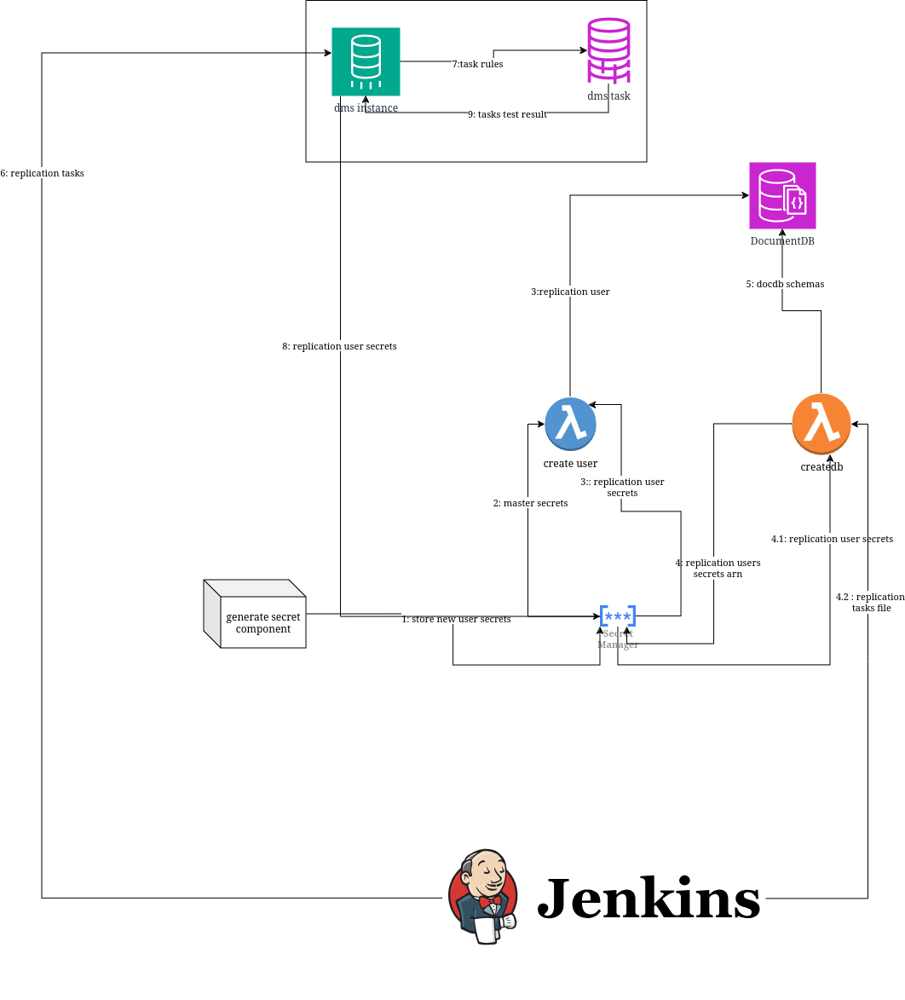

# Infraestructura del dominio 5

<!-- 
 -->
## STACK

## Component: DocumentDB

[DocumentDB](./components/docDB_documentation.md)

Base de datos destino donde se guardará la replicación del MongoDB, sub-componentes:
- Subnet group: Grupo de sub redes donde se despelgará las intancias del cluster de DocumentDB
- Parametr group: Grupo de configuraciones del DocumentDB, en este caso se usa para deshabilitar TLS
- Instancias: Conjunto de instancias del Cluster de DocumentDB

## Component: Secret-Manager


[Secret: generador del secreto para el usuario replicación](./components/secret_docdb_credentials_documentation.md)

Secreto donde se guardarán las credenciales del usuario de DocumentDB que usará el DMS para la replicación del MongoDB hacia el DocumetnDB


## Component: IAM-Policies

[ Access ec2](./components/policy_access_ec2.md)

Política que le da permisos a la lambda para poder apagar, prender, ejecutar comandos mediante ssm a una instancia ec2.

[Access s3](./components/policy_access_s3.md)

Política que le da permisos a la lambda para poder leer objetos de un s3

[Secret manager](./components/policy_get_secret.md)

Política que le da permisos a la lambda para poder leer el contenido de un secreto de Secret Manager.


## Component: IAM-Roles

[IAM: roles para las lambdas](./components/role_lambda.md)

Plantilla para que las lambdas asuman un rol


## Component: Security-Group


[IAM: roles para las lambdas](./components/security_group.md)

Plantilla para establecer los security groups de las lambdas, del DocumentDB, ec2 y la instancia de repliación del DMS


## Component: Lambda create-user-db

[lambda: creacion de usuario para la replicación](./components/lambda_user_docdb_documentation.md)

Lambda que se usará para crear el usuario del DocumentDB que usará el DMS para la migración y replicación, además creará las bases de datos y colecciones especificadas en el archivo dmsReplicationTasks.json


## Component: DMS

[Database Migration Service](./components/dms_documentation.md)

Este servicio de AWS sirve para la migración y replicación entre bases de datos, siempre y cuando al menos una de ellas esté en una VPC de AWS, sub-componentes:
- Source enpoint: Establece la conexion con la base de datos fuente
- Target endpoint: Establece la conexion con la base de datos destino
- Replication instance: Máquina virtual donde se correrán las tareas de replicación
- Replication task: Proceso de replicación de un conjunto de colecciones de una misma base de datos de MongoDB
- Subnet group: grupo de subnets donde correrá la instancia de replicación


## Component: EC2 replication-mongodb-docdb
[EC2 replicacion](./components/ec2_replication.md)

Ec2 donde se ejecutarán los servicios:
- replication service
-  monitor-replication service
-  restore service
-  backup service
-  monitor-restore service
-  clean service
-  monitor-clean service

El servicio de replication es aprovisionado mediante el user_data del ec2 en el terraform y los otros 6 son aprovisionados mediante las siguientes funciones lambda.
## Component: Lambda start-replication

[Lambda start replication](./components/lambda_start_replication.md)

Esta función lambda se encarga de lo siguiente:
1. Prende la instancia ec2
2. Activa el changeStreams a nivel de cluster en el DocumentDB
3. Activa el servicio de replication del ec2.
4. Actualiza el usuario que usan los microservicios a permisos de read, insert y update en todas las bases de datos y colecciones.


Servicios:

1. replication.service: se encarga de replicar todas las operaciones (insert, update) que ocurren en cualquier documento del DocumentDB y subirlo al S3 en formato bson, lo sube en la carpeta replication/ con el formato: "<database_name>/<collection_name>/<timestamp_documentId>.bson


## Component: Lambda restore-replication
Esta función lambda se encarga de lo siguiente:
1. Actualiza el rol del usuario de DocumetnDB que usan los microservicios a permisos de solo lectura en todas las bases de datos y colecciones.
2. Aprovisiona al ec2 los servicios de backup.service, restore.service y monitor-replication.service
3. Activa los servicios de backup service y monitor-replication service

Servicios:
1. backup.service: se encarga de generar un mongodump (respaldo de una base de datos) del MongoDB, antes de hacer la restauración, y del DocumentDB, estos dumps los sube al s3 en la carpeta dump/.
2. monitor-replicaiton.service: se encarga de verificar que replication.service haya terminado de procesar todas las operaciones que están en la cola del changeStream del DocumentDB, mediante revisiones ciclicas de 5 minutos, una vez replication.service haya terminado, monitor-replication.service inicia restore.service.
3. restore.service: se encarga de restaurar todas las operaciones que están registradas en el S3 hacia el MongoDB.

## Component: Lambda clean-replication
Esta función lambda se encarga de lo siguiente:
1. Aprovisiona los servicios de monitor-restore.service, clean.service y monitor-clean.service
2. Ejecuta el servicio monitor-restore.service.

Sevicios:
1. monitor-restore.service: se encarga de verificar que restore.service haya termina su ejecución, una vez detecta que ya terminó activa clean.service y monitor-clean.service.
2. clean.service: se encarga de limpiar la carpeta replication/ del s3, borrar el archivo data_resume_token.json que usa replication.service para controlar el cursor del changestream de DocumentDB y cierra el changestream del DocumentDB.
3. monitor-clean:monitorea que clean.service y backup.service hayan terminado para proceder a apagar la instancia ec2.

##  Component: EC2 Kafka cluster

Son los 2 (o mas) ec2 que forman el cluster de kafka homologado al ambiente de produccion o de QA, no contiene variables de entorno
y son configurados por medio de una lambda

Servicios:
1. zookeeper.service: se encarga de mantener el estado del cluster de kafka, si un nodo se cae, zookeeper.service se encarga de elegir un nuevo lider y mantener la consistencia del cluster.
2. kafka.service: se encarga de mantener el estado del cluster de kafka, si un nodo se cae, kafka.service se encarga de elegir un nuevo lider y mantener la consistencia del cluster.

### Consideraciones:

1. Al crear el eks se le debe dar acceso
2. Debe tener un rol de iac que le de acceso al eks


[ver la documentacion de MM2](./components/MM2-Documentation.md)

## Component: lambda setup-kafka-cluster

Lambda que se encarga de aprovisionar los servicios de zookeeper y kafka en los ec2 del cluster de kafka, se ejecuta una sola vez al inicio de la infraestructura.

```sh
@param
kafka_ip: ip del nodo (ec2) del cluster de kafka
kafka_id: id del nodo (ec2) del cluster de kafka
```

* los ip los obtiene como variable en el flujo CD/CI (env de jenkis)
* los id los obtiene como output del modulo de ec2


##  DESPLIEGUE DE LA INFRAESTRUCTURA

  Pre condiciones:
  - Debe existir o crear un secreto genérico en secret manager que almacena las credenciales del usuario maestro de docdb, ese secreto es una estructura llave-valor, cuyas llaves son: "username" y "password".
  - Debe existir o crear un usuario en el MongoDB on-premise con los permisos de "write", "find", "changeStream" y el rol de
  "read", revisar sección "**Permissions needed when using MongoDB as a source for AWS DMS**" de https://docs.aws.amazon.com/dms/latest/userguide/CHAP_Source.MongoDB.html

  - El MongoDB es un replica-set, revisar sección "**Configuring a MongoDB replica set for CDC**" de https://docs.aws.amazon.com/dms/latest/userguide/CHAP_Source.MongoDB.html

  Flujo del terraform:
  - Se crea un DocumentDB, cuyo username y password del usuario maestro se obtienen de las credenciales del secreto de Secret Manager.
  - Se crea un secreto en Secret Manager con las credenciales (username y password) del usuario ed DocumentDB que usará el DMS para la replicación, el username es ingresado como variable mientras que el password es  generado de forma aleatoria por terraform.
  - La lambda create-user-db crea un usuario en DocumentDB con las credenciales del secreto previamente creado.
  - La lambda create-user-db crea las bases de datos y colecciones especificadas en el archivo dmsReplicationTasks.json en el DocumentDB.
  - Se crea la instancia de replicación del DMS, los endpoints y las tareas de replciación de acuerdo al archivo de configuración dmsReplicationsTasks.json
  - Se aprovisionan el EC2 y las lambdas start-replication, restore-replication y clean-replication que se usarán para la vuelta al MongoDB despueś de la contingencia.

Post condiciones:
  - Bases de datos y colecciones creadas en el DocumentDB.
  - Tareas de replicación creadas y funcionando.


## Consideraciones de valores de las variables del IaC
[stack de la solución](./stack_iac.md)

### **DocumentDB**

#### **Parameter group**
- **docdb_cluster_parameter_group_family**: `String` — Dejar el valor por defecto `"docdb4.0"`.
- **docdb_cluster_parameter_group_name**: `String` — Ingresar nombre deseado.
  
#### **DocumetnDB**
- **docdb_master_user_secret_name**: `String` — Debe ser el nombre del secreto que almacena las credenciales (username y password) del DocumentDB, este ya existe previamente.
- **docdb_subnet_group_name**: `String` — Ingresar nombre deseado.
- **docdb_subnets_ids**: `List[String]` — Ingresar valores de subnets privadas deseadas.


- **docdb_cluster_replication**:
    - **cluster_identifier**: `String` — Ingresar nombre deseado.
    - **engine_version**: `String` — Dejar el valor por defecto `"4.0.0"`.
    - **preferred_backup_window**: `String` — Poner un valor en el que el DocumentDB esté en menor uso, ejemplo de valor: `"02:00-03:00"`.
    - **backup_retention_period**: `Integer` — Ingresar periodo deseado.
    - **availability_zones**: `List[String]` — Ingresar zonas de disponibilidad que coincidan con las zonas de disponibilidad de las subnets privadas.
    - **apply_immediately**: `Boolean` — Dejar valor por defecto `true` para el primer despliegue.
    - **preferred_maintenance_window**: `String` — Ingresar una fecha en la que el DocumentDB esté en menor uso, ejemplo: `"sun:04:00-sun:05:00"`.
    - **deletion_protections**: `Boolean` — Debe ser `true` en producción para evitar su eliminación por Terraform.
    - **skip_final_snapshot**: `Boolean` — Ingresar el valor deseado.
    - **port**: `Integer` — Ingresar el valor deseado, valor por defecto para MongoDB: `27017`.
- **docdb_cluster_instance_class**: `String` — Ingresar tipo de instancia adecuada para el uso del documentDB.
- **docdb_cluster_instance_count**: `Integer` — Ingresar cantidad de instancias del cluster, recomendación: 3

#### **Security Group del DocumentDB**
- **docdb_sg_name**: `String` — Ingresar nombre deseado.
- **docdb_sg_description**: `String` — Ingresar descripción deseada.
- **docdb_ingress_rules**: `List[Object]` — Habilitar la conexión TCP del puerto que se definió en las instancias de DocumentDB, para que el DMS, las lambdas y el EC2 se conecten por ahí.
  - **from_port**: `Integer` — Ingresar puerto de inicio para la regla de ingreso
  - **to_port**: `Integer` — Ingresar puerto de destino para la regla de ingreso
  - **protocol**: `String`— Habilitar protocolo TCP en cada objeto del array.
  - **cidr_blocks**: `List[String]` — Poner el CIDR
- **docdb_egress_rules**: `List[Object]` — Dejar el valor por defecto: `[]`.

### **Secreto del usuario del DocumentDB para la replicación**
- **dms_secret_user_replication_name**: `String` — Ingresar valor deseado.
- **dms_user_replication_username**: `String` — Ingresar valor deseado.

### **Políticas y rol para las lambdas create-user--db**
- **iam_policy_lambda_access_docdb_name**: `String` — Ingresar nombre deseado.
- **iam_role_lambda_access_docdb_name**: `String` — Ingresar nombre deseado.
- **lambda_subnet_ids**: `List[String]` — Ingresar el valor de una subnet privada.

### **Lambda crear usuario**
- **lambda_create_user_db_function_name**: `String` — Ingresar valor deseado.

### **Security Group de todas las lambdas**
- **lambda_sg_name**: `String` — Ingresar nombre deseado.
- **lambda_sg_description**: `String` — Ingresar descripción deseada.
- **lambda_ingress_rules**: `List[Object]` — Dejar valor por defecto: `[]`.
- **lambda_egress_rules**: `List[Object]` — Poner reglas de egreso que le permita conectarse al DocumentDB (a través del puerto configurado del DocumentDB) y a las instancias EC2 creadas (a través del puerto 22).

---

### **DMS**

- **dms_cloudwatch_role_name**: `String` — Ingresar nombre deseado.
- **dms_vpc_role_name**: `String` — Ingresar nombre deseado.

#### **Endpoints**
- **mongodb_onpremise_username**: `String` — Ingresar username del usuario de MongoDB on-premise.
- **mongodb_onpremise_password**: `String` — Ingresar password del usuario de MongoDB on-premise.
- **kms_key_arn**: `String` — Ingrese el valor del kms del DMS gestionado por AWS.
- **dms_target_endpoint_engine_name**: `String` — Dejar el valor por defecto `"docdb"`.
- **dms_endpoint_mongodb**:
  - **endpoint_id**: `String` — Ingresar el nombre deseado.
  - **server_name**: `String` — Ingresar la ip | dominio del MongoDB.
  - **database_name**: `String` — Dejar el valor por defecto `""` para permitir uan conexión con todas las bases de de datos de MongoDB.
  - **port**: `Integer` — Ingresar puerto del MongoDB on-premise.
- **dms_endpoints_docdb**: `List[Object]` — Ingresar lista de endpoints del DocumentDB:
  - **endpoint_id**: `String` — Ingresar nombre deseado que coincida con los endpoints del archivo dmsReplicationTasks.json.
  - **database_name**: `String` — Ingresar nombre de la base de datos del MongoDB que se quiere migrar.

#### **Subnet Group**
- **dms_subnet_group_mongodb_docdb**:
  - **replication_subnet_group_id**: `String` — Ingresar nombre deseado.
  - **subnet_ids**: `List[String]` — Ingresar subnets privadas.
  - **replication_subnet_group_description**: `String` — Ingresar descripción deseada.

#### **Instancia de replicación**
- **dms_ri_mongodb_docdb**:
  - **replication_instance_id**: `String` — Ingresar nombre deseado.
  - **allocated_storage**: `Integer` — Ingresar cantidad de almacenamiento deseada en GB, recomendación mínimo `50`
  - **allow_major_version_upgrade**: `Boolean` — Ingresar el valor deseado.
  - **apply_immediately**: `Boolean` — Ingresar el valor deseado.
  - **auto_minor_version_upgrade**: `Boolean` — Ingresar el valor deseado, recomedación : `true`
  - **availability_zone**: `String` — Ingresar un valor que coincida con el valor de las subnet_ids del `dms_subnet_group_mongodb_docdb`.
  - **engine_version**: `String` — Dejar el valor por defecto `"3.5.2"`.
  - **multi_az**: `Boolean` — Ingresar el valor deseado.
  - **publicly_accessible**: `Boolean` — Dejar el valor por defecto `false`.
  - **replication_instance_class**: `String` — Ingresar tipo de instancia correspondiente para la cantidad de datos del MongoDB.
  - **preferred_maintenance_window**: `String` — Ingresar rango en el que esté en menor uso el DocumentDB, ejemplo: `Mon:03:00-Mon:05:00`

#### **Tareas de replicación**
- **dms_replication_task_migration_type**: `String` — Dejar el valor por defecto `"full-load-and-cdc"`.
- **dms_start_replication_task**: `String` — Ingresar el valor deseado.

#### **Security group del DMS**
- **dms_sg_name**: `String` — Ingresar nombre deseado.
- **dms_sg_description**: `String` — Ingresar descripción deseada.
- **dms_ingress_rules**: `List[Object]` — Ingresar valor por defecto `[]`.
- **dms_egress_rules**: `List[Object]` — Ingresar valores que le permitan conectarse mediante TCP al puerto del MongoDB on-premise y al puerto del DocumentDB.

---

### **S3**
- **s3_bucket_name**: `String` — Ingresar nombre deseado.

### **EC2 de replicación**

#### **Rol y políticas**
- **iam_policy_ec2_name**: `String` — Ingresar nombre deseado.
- **iam_role_ec2_name**: `String` — Ingresar nombre deseado.
- **ec2_name**: `String` — Ingresar nombre deseado.
- **ec2_key_pair_name**: `String` — Ingresar nombre deseado.
- **ec2_instance_type**: `String` — Ingresar un tipo de instancia, recomendación : t3.large
- **ec2_subnet_id**: `String` — Ingresar subnet privada.
- **ec2_volume_size**: `Integer` — Ingresar valor deseado, recomendación: `50GB`.

#### **Security group del EC2 de replicación**
- **ec2_sg_name**: `String` — Ingresar nombre deseado.
- **ec2_sg_description**: `String` — Ingresar descripción deseada.
- **ec2_ingress_rules**: `List[Object]` — Abrir el puerto 22 si lo desea.
- **ec2_egress_rules**: `List[Object]` — Dejar el valor por defecto: from_port = 0, to_port = 0, protocol = "-1", cidr_blocks = ["0.0.0.0/0"]

### **Lambdas start-replication, restore-replication, clean-replication**
- **iam_role_lambda_repl_name**: `String` — Ingrese nombre deseado.
- **iam_policy_lambda_access_ec2_name**: `String` — Ingrese nombre deseado.
- **iam_policy_lambda_access_s3_name**: `String` — Ingrese nombre deseado.
- **lambda_start_replication_function_name**: `String` — Ingrese nonbre deseado.
- **lambda_restore_replication_function_name**: `String` — Ingrese nombre deseado.
- **lambda_clean_replication_function_name**: `String` — Ingrese nombre deseado.

#  Casos de Uso

### Iniciar las tareas de replicacion


### 1. Actualizar el usuario de docdb que usan los target endpoints para la replicacion
Los target endpoint usan el usuario replicacion que fue creado por la lambda crear usuario, las credenciales de este usuario son almacenadas en un secreto de secret manager, un secreto que es una estructura: llave-valor con llaves: username y password, los target endpoints usan el arn del secreto internamente para acceder al secreto por lo tanto siempre habrá que usar ese secreto, pero aún así se puede actualizar el usuario y la contraseña:
>  #### Actualizar el usuario y contraseña

Pre condiciones:
- Las tareas deben estar detenidas, puede pausarlas cambiando el valor de la variable dms_start_replicacion_tasks a false y correrlo


Procedimientos para actualizar este usuario:
- Cambiar el valor del username del usuario de replicación en la variable dms_user_replication_username, esto hará que el componente secret-docdb detecte el cambio y al momento de correr el código generará una nueva contraseña mediante el componente random_password de terraform.
- Una vez hayan corrido el paso anterior, ahora deben cambiar el valor de dms_start_replication_tasks a true para reanudar las tareas y correrlo de nuevo

Post condiciones:
- Username y password actualizado
- Tareas replicando
- El usuario anterior sigue existiendo en el docdb (eliminarlo mediante una conexion ssh o rpd mediante el usuario master del docdb)
> #### Solo actualizar la contraseña:
  Para cambiar la contraseña debería crear una lambda que tenga permisos de ejecutarse dentro de esa VPC, acceder al secreto del usuario de replicación y al docdb de destino y ejecutar el código necesario para actualizaro, las pre condiciones son iguales que para el primer caso, deben pausar las tareas,


### 2. Creación de una nueva base de datos y colecciones

Las tareas de replicación, de ahora en adelante solo tareas, y las bases de datos junto a sus colecciones están estrechamente relacionadas mediante el archivo dmsReplicationTask.json, la creación y destrucción de estas es bidireccional, si un conjunto de colecciones se crea/destruye su tarea asociada también, la creación/destrucción de estas se realiza configurando el archivo dmsReplicationTask.json.
Entonces al momento de que se quiere agregar una nueva base de datos, se deberá crear la tarea asociada a la replicación de esa base de datos y ese conjunto de colecciones.

Pre condiciones:
- La base de datos y sus colecciones deben existir en el mongodb on-premise.
- Las tareas deben estar pausadas, puede pausarla cambiando el valor de la variable dms_start_replication_task a false y correrlo.
- Asegurarse que el usuario del MongoDB on-premise que usa el DMS tenga los mismos permisos sobre las nuevas bases de datos y colecciones.
Procedimiento:


- Agregar el nuevo target endpoint de la nueva base de datos en la variable  dms_endpoints_docdb
- Los campos que debería llenar son:
> - endpoint_id = "nuevoEnpointId"
> - database_name = "nuevaBaseDatos"

Ejemplo:
```json
 [
    #Nuevo endpoint:
    {
      endpoint_id   = "nuevoEndpointId"
      database_name = "nuevaBaseDatos"
    },
    #Bases de datos ya existentes:
    {
      endpoint_id   = "test-docdb-cuenta-digital"
      database_name = "Si_DbClaCuentaDigital"
    },
    {
      endpoint_id   = "test-docdb-firmas"
      database_name = "Si_DbClaFirmas"
    }.
    ...
    ...
    ...
  ]
```

- Luego modificar el archivo dmsReplicationTask.json  agregando una nueva tarea.

Ejemplo:

> - nombre de la nueva base de datos: nuevaBaseDatos <br>
> - nombre de coleccion 1: coleccion_1 <br>
> - nombre de coleccion 2: coleccion_2 <br>

Leer sección "Inputs > Files" del componente DMS para entender mejor que colocar en los campos task_id, rule-id, rule-name, schema-name, target_endpoint_key, etc.

Debería agregar la siguiente tarea al json con este formato:
```json
[
    {
    "task_id": "task_id",
    "table-mappings": {
      "rules": [
        {
          "rule-type": "selection",
          "rule-id": "rule_id_1",
          "rule-name": "rule_name_1",
          "object-locator": {
            "schema-name": "nuevaBaseDatos",
            "table-name": "coleccion_1"
          },
          "rule-action": "include",
          "filters": []
        },
        {
          "rule-type": "selection",
          "rule-id": "rule_id_2",
          "rule-name": "rule_name_2",
          "object-locator": {
            "schema-name": "nuevaBaseDatos",
            "table-name": "coleccion_2"
          },
          "rule-action": "include",
          "filters": []
        }
      ]
    },
    "target_endpoint_key": "nuevoEndpointId"
    },
  ...
  ...
  ...
]
```


- Una vez modificado el dmsReplicationTasks.json y cambiar el dms_start_replication_task a true y correrlo


Post-condiciones:
- Base de datos y colecciones creadas en el docdb.
- Tarea de replicación replicando las colecciones establecidas.

### 3. Eliminación de una base de datos
Pre condiciones:
- Las tareas deben estar pausadas, puede pausarla cambiando el valor de la variable dms_start_replication_task a false y correrlo

Procedimiento:

- Ir al archivo dmsReplicationTask.json y eliminar todas las tareas asociadas a esa base de datos, es decir todas las tareas que tengan su campo schema_name: "Nombre de la base de datos que quiere borrar"
- Borrar en la variable dms_endpoints_docdb el endpoint cuyo campo database_name coincida con el nombre de la base de datos que se quiere borrar y correrlo
- Cambiar el campo dms_start_replication_task a true y correrlo

Nota:El lambda solo borrará la base de datos si se encuentra en el entorno de qa y dev, en entorno de prod no borra la bases de datos del docdb, solo se borraría la tarea de replicación y la base de datos seguirá existiendo en el docdb.


### 4. Eliminación de colecciones
Pre condiciones:
- Las tareas deben estar pausadas, puede pausarla cambiando el valor de la variable dms_start_replication_task a false y correrlo.

Procedimiento:

- Ir al archivo dmsReplicationTask.json y eliminar todas la regla de la tarea asociada a esa colección, es decir todas las reglas de la tarea que tengan su campo table_name: "Nombre de la colección que quieren borrar".

Ejemplo:

Supongamos que quiere borrar la coleccion_2, este sería el dmsTaskSetting.json al inicio
```json
[
    {
    "task_id": "task_id",
    "table-mappings": {
      "rules": [
        {
          "rule-type": "selection",
          "rule-id": "rule_id_1 ",
          "rule-name": "rule_name_1",
          "object-locator": {
            "schema-name": "nuevaBaseDatos",
            "table-name": "coleccion_1"
          },
          "rule-action": "include",
          "filters": []
        },
        {
          "rule-type": "selection",
          "rule-id": "rule_id_2",
          "rule-name": "rule_name_2",
          "object-locator": {
            "schema-name": "nuevaBaseDatos",
            "table-name": "coleccion_2"
          },
          "rule-action": "include",
          "filters": []
        }
      ]
    },
    "target_endpoint_key": "endpoint_id"
  },
  ...
  ...
  ...
]
```
Y este sería el dmsTaskSetting.json al final:
```json
[
    {
    "task_id": "task_id",
    "table-mappings": {
      "rules": [
        {
          "rule-type": "selection",
          "rule-id": "rule_id_1 ",
          "rule-name": "rule_name_1",
          "object-locator": {
            "schema-name": "nuevaBaseDatos",
            "table-name": "coleccion_1"
          },
          "rule-action": "include",
          "filters": []
        },
      ]
    },
    "target_endpoint_key": "endpoint_id"
  },
  ...
  ...
  ...
]
```

- Una vez borrado del dmsReplicationTask.json corremos el código
- Luego para activar las tareas, cambiamos la variable dms_start_replication_task a true y lo corremos
Post condiciones:

La tarea asociada a ese task_id solo repliclará las colecciones que no fueron eliminadas, en este ejemplo solo coleccion_1 y ya no coleccion_2.

Nota: El lambda solo borrará las colecciones si se encuentra en el entorno de "qa" o "dev", en entorno de "prod" no borra las colecciones solo dejaría de replicar, la variable que determina el entorno es aws_project_env.

### 5. Agregar otra coleccion a una tarea de replicacion
Pre condiciones:
- La colección debe existir en la base de datos fuente
- Las tareas deben estar pausadas, puede pausarla cambiando el valor de la variable dms_start_replication_task a false y correrlo

Procedimiento:

- Ir al archivo dmsReplicationTask.json e identificar la tarea de replicación donde quieres colocar la nueva colección

Ejemplo: Supongamos que quiere añadir la coleccion_3 en la tarea que replica la coleccion_1 y coleccion_2

Nota: para que funcione las colecciones ya existentes y la nueva coleccion deben estar en la misma base de datos fuente y destino (la creación de la colección en el docdb será función de la lambda-create-user)

dmsReplicationTask.json al inicio:
```js
[
    {
    "task_id": "task_id",
    "table-mappings": {
      "rules": [
        {
          "rule-type": "selection",
          "rule-id": "rule_id_1 ",
          "rule-name": "rule_name_1",
          "object-locator": {
            "schema-name": "nuevaBaseDatos",
            "table-name": "coleccion_1"
          },
          "rule-action": "include",
          "filters": []
        },
        {
          "rule-type": "selection",
          "rule-id": "rule_id_2",
          "rule-name": "rule_name_2",
          "object-locator": {
            "schema-name": "nuevaBaseDatos",
            "table-name": "coleccion_2"
          },
          "rule-action": "include",
          "filters": []
        }
      ]
    },
    "target_endpoint_key": "endpoint_id"
  },
]
```

dmsReplicationTask.json después de agregar la nueva colección:

```json
[
    {
    "task_id": "task_id",
    "table-mappings": {
      "rules": [
        {
          "rule-type": "selection",
          "rule-id": "rule_id_1 ",
          "rule-name": "rule_name_1",
          "object-locator": {
            "schema-name": "nuevaBaseDatos",
            "table-name": "coleccion_1"
          },
          "rule-action": "include",
          "filters": []
        },
        {
          "rule-type": "selection",
          "rule-id": "rule_id_2",
          "rule-name": "rule_name_2",
          "object-locator": {
            "schema-name": "nuevaBaseDatos",
            "table-name": "coleccion_2"
          },
          "rule-action": "include",
          "filters": []
        },
        {
          "rule-type": "selection",
          "rule-id": "rule_id_3",
          "rule-name": "rule_name_3",
          "object-locator": {
            "schema-name": "nuevaBaseDatos",
            "table-name": "coleccion_3"
          },
          "rule-action": "include",
          "filters": []
        }
      ]
    },
    "target_endpoint_key": "endpoint_id"
  },
  ...
  ...
  ...
]
```
- Una vez agregada la nueva regla a la tarea, cambiamos la variable dms_start_replication_task a true y correrlo

Post-condiciones:
- La nueva colección estará creada en el docdb.
- La tarea replicará también la nueva colección establecida.

### 6. Restaurar las bases de datos a mongodb onpremise con EC2


#### 6.1 Iniciar la lambda de start replication

Pre condiciones:
- Tareas de replicacion del DMS pausadas
- MongoDB caído o fuera de servicio,
- Existe el usuario en DocumentDB que usan los microservicios

Procedimiento:
- Input de la lambda:
  - ```
    {
      "DOCDB_USER_APLICATION_USERNAME" : "<Username del usuario de DocumentDB que usan los microservicios>"
    }
    ```

- Flujo de la lambda:
  - Inicia una instancia EC2 y espera que esté lista.

  - Actualiza el usuario de documentDB que usarán los microservicios con permisos para insertar, actualizar y leer documentos en todas las bases de datos especificadas en el archivo dmsReplicationTasks.json

  - Inicializa el servicio de replication.service, este servicio se encarga de subir a S3 las operaciones (inserciones, actualizaciones, eliminaciones) que se aplican a los documentos de las diferentes colecciones y bases de datos del DocumentDB, puede ver su estado y sus logs con los siguientes comandos:
    ```
    sudo systemctl status replication.service
    sudo journalctl -u replication.service -n 50
    ```

Post condiciones:
- Servicio de replicación iniciado y subiendo las operaciones del DocumentDb al bucket de S3.

#### 6.2 Inicar la lambda de restore replication
Pre condiciones:
- La lambda start replication fue ejecutada
- Servicio de replication iniciado y corriendo
- MongoDB operativo y permite acceso del EC2
- Existe usuario en mongoDB con permisos de lectura y escritura

Proceimiento:
- Input de la lambda
  - ```
    {
      "DOCDB_USER_APLICATION_USERNAME" : "<Username del usuario que usan los microservicios para escribir en documentDB>",
      "MONGODB_USERNAME":"<Username del usuario de MongoDB on-premise>",
      "MONGODB_PASSWORD":"<Password del usuario de MongoDB on-premise>",
      "MONGODB_ENDPOINT":"<Endpoint | ip | dominio del servidor de MongoDB>",
      "MONGODB_PORT":"<Puerto del MongoDB>"
    }
    ```
    EJemplo:
  - ```
    {
      "DOCDB_USER_APLICATION_USERNAME" : "user-test",
      "MONGODB_USERNAME":"test",
      "MONGODB_PASSWORD":"testtest",
      "MONGODB_ENDPOINT":"testqa-mongodb01.losandes.pe",
      "MONGODB_PORT":"27017"
    }
    ```
  *Nota: El usuario de MongoDB que se vaya a ingresar debe tener permisos de lectura y escritura en las bases de datos que se están replicando*


- Flujo de la lambda:
  - Actualiza el usuario "DOCDB_USER_APLICATION_USERNAME" a permisos de solo lectura en todas las bases de datos y colecciones del documentDB.
  - Aprovisiona estos 3 servicios:
    - restore.service: Se encarga de restaurar el contenido del S3 (las operaciones registrados mientras el mongoDB estaba fuera de servicio) hacia el mongoDB
    - monitor_replication.service: Se encarga de monitorear que el servicio de replication haya acabado para empezar la restauración del S3 hacia el mongoDB, verifica en un intervalo de 5 minutos de forma constante si es que hay cambios en el S3, cuando ya no detecta cambios, después de 5 minutos activa el servicio de restore.
    - backup.service: Se encarga de generar un dump del mongoDB y documentDB  y subirlo al S3.
  - Inicializa primero el servicio monitor_replication y backup, el servicio restore es iniciado por el servicio monitor_replication caundo se cumpla la condición de que el servicio de replication haya acabado.
  -
Post condiciones:
- Servicio de monitor_replication corriendo
- Servicio de restore a la espera de ser iniciado por el servicio de monitor_replication
- Servicio de backup corriendo


#### 6.3 Inicar la lambda de clean replication

Pre condiciones:
- Lambda restore replication fue ejecutada

Procedimiento:
- Input:
  - No hay input
- Flujo de la lambda:
    - Aprovisionar estos 3 servicios:
      - clean.service: Servicio de borrar el resumeTokenJSON que usa el servicio de replication para asegurar la consistencia en el procesamiento de operaciones del documentDB, borrar la carpeta replication/ del S3.
      - monitor_restore.service: Servicio que monitorea que el servicio de restore.service haya finalizado para ejecutar el servicio de clean.service.
      - monitor_clean.service: Servicio que monitorea que el servicio clean.service y backup.service hayan terminado para apagar el EC2 donde se están ejecutando todos los servicios.
  - Inicializa el serivcio de monitor_restore y los otros dos se ejecutan automaticamente de acuerdo al servicio monitor_restore

Post condiciones:
  - Carpeta replication/ del S3 siendo limpiada
  - Ec2 apagado

#### 6.4 Reactivar las tareas
Reactivar las tareas cambiando el valor de dms_start_replication a true y correrlo


#### Nota

El EC2 debe estar prendido todo el tiempo que el MongoDB esté fuera de servicio, es decir, todo el tiempo que los microservicios estén usando a DocumentDB para realizar sus operaciones.


## Errores que se pueden producir al correr el código

  > - ### Al momento de reanudar las tares se puede producir este error

```bash
│ Error: waiting for DMS Replication Task (cobranza-2) start: unexpected state 'stopped', wanted target 'running'. last error: Stop Reason NORMAL
│
│   with module.domain5_dms.aws_dms_replication_task.replication_task["cobranza-2"],
│   on ../aws-modules/aws-dms-module/dms-mongodb/main.tf line 160, in resource "aws_dms_replication_task" "replication_task":
│  160: resource "aws_dms_replication_task" "replication_task" {
│
╵
╷
│ Error: waiting for DMS Replication Task (cuenta-digital-1) start: unexpected state 'stopped', wanted target 'running'. last error: Stop Reason NORMAL
│
│   with module.domain5_dms.aws_dms_replication_task.replication_task["cuenta-digital-1"],
│   on ../aws-modules/aws-dms-module/dms-mongodb/main.tf line 160, in resource "aws_dms_replication_task" "replication_task":
│  160: resource "aws_dms_replication_task" "replication_task" {
│
```
- Este error no significa que la tarea halla fallado, si revisa la consola, la tarea que supuestamente falló segun la terminal, está corriendo igual que las demás tareas, si hace un "terraform refresh" y luego un "terraform apply" de nuevo, terraform se actualizará y corrigirá el estado de la tarea, saldría un resultado como este:
```bash
No changes. Your infrastructure matches the configuration.

Terraform has compared your real infrastructure against your configuration and found no differences, so no changes are needed.

Apply complete! Resources: 0 added, 0 changed, 0 destroyed.
```
Nota: el error que salió es principalmente por un error de sincronización de estado de la tarea entre Terraform y AWS.

  > - ### Actualizar el código de alguna función lambda


 - Terraform para identificar si las funciones han ambiado usa una función hash, y si cambia la función el hash que producirá esa función actualizada con la que tenía terraform en memoria seran diferentes por ende no reconocerá la función, basta con aplicar un terraform refresh y un terraform apply o simplemente un terraform apply una vez que falló para que se actualice el nuevo hash y ahora correrá sin problemas.
