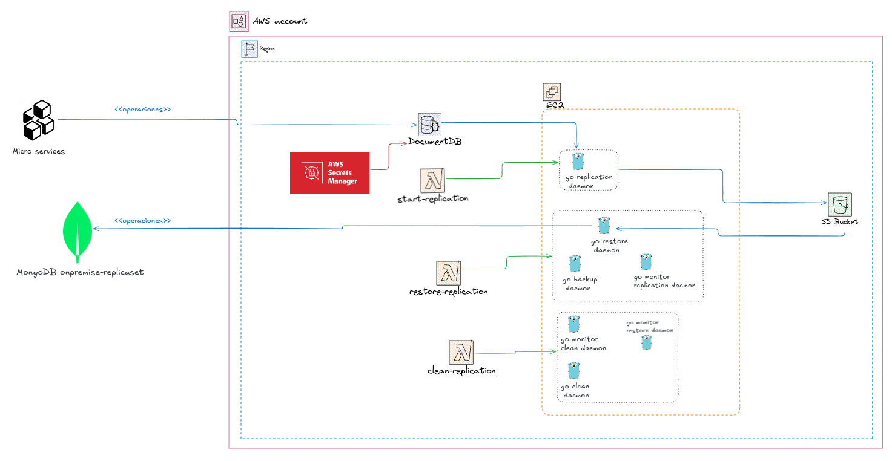
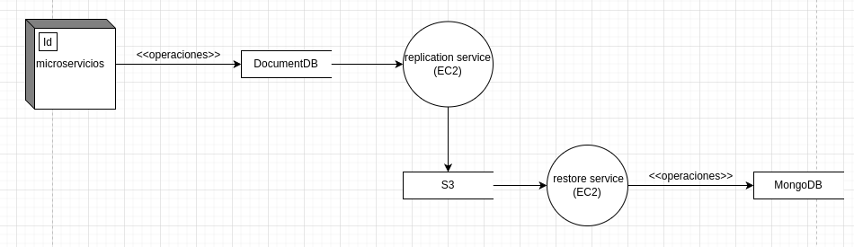

# Back Over

## Componentes

### Micro servicios
Aplicaciones independiente que realizan sus operaciones CRUD sobre DocumentDB

### DocumentDB
Base de datos adminsitrada por AWS donde los microservicios realizan sus operaciones CRUD

### Secret Manager
Almacena las credenciales del usuario maestro del DocumentDB.

### S3
Almacena los archivos BSON de las operaciones realizadas en DocumentDB y los backups generados del MongoDB y DocumentDB.

### Lambda start replicatión
Función Lambda responsable de inicializar y gestionar el proceso de replicación desde DocumentDB hacia S3. Sus principales responsabilidades incluyen:

- Actualización de credenciales: Modifica y actualiza el usuario que utilizan los microservicios en DocumentDB.
- Activación de ChangeStreams: Habilita los ChangeStreams en DocumentDB para capturar eventos en tiempo real.
- Inicio del servicio de replicación: Lanza y gestiona el servicio de replicación en la instancia EC2, replicando las operaciones que ocurren en DocumentDB hacia S3 en formato BSON

### Lambda restore replication
Función Lambda encargada de orquestar el proceso de restauración y respaldos. Sus tareas principales son:

- Actualización de permisos: Cambia el usuario de los microservicios a permisos de solo lectura para garantizar integridad durante la restauración.
- Aprovisionamiento de servicios: Inicia los servicios necesarios en EC2, como:
  - Monitor Replication: Supervisa el estado del proceso de replicación y, al finalizar, activa el servicio de restauración.
  - Backup: Realiza copias de seguridad tanto de MongoDB como de DocumentDB, y almacena estos respaldos en S3.
  - Restore: Descarga las operaciones almacenadas en S3 hacia EC2 y las replica de forma ordenada en MongoDB.
- Inicio de servicios clave: Activa el monitoreo y las tareas de respaldo para garantizar una restauración completa y ordenada.

### Lambda clean replication
Lambda que aprovisiona los servicios monitor_restore (monitore el estado del servicio restore y cuando este haya finalizado activa el servicio de clean), clean (ester servicio cierra los changeStream del DocumentDB y borra los archivos BSON del S3), monitor-clean (monitorea el estado del servicio clean, y cuando este acaba apaga el EC2)

### EC2
Es la instancia de cómputo donde se ejecutan los servicios aprovisionados por las funciones Lambda.

## Diagrama de flujo de datos de las operaciones
