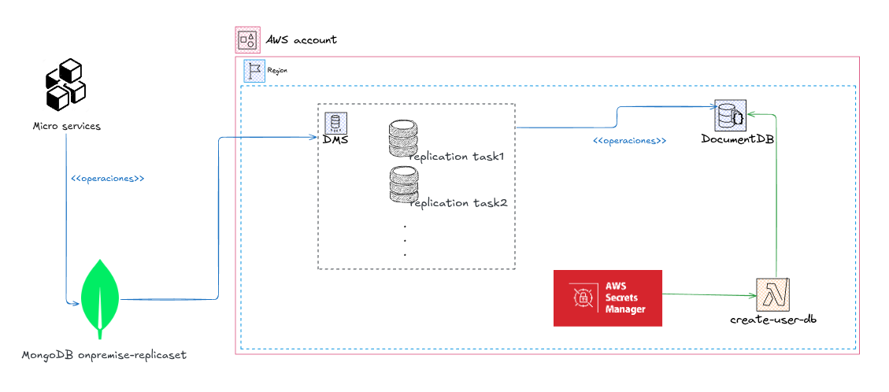

# Fail Over
## Componentes

### Microservicios
Aplicaciobnes independientes que realizan operaciones CRUD sobre la base de datos fuente MongoDB.

### MongoDB
Almacenamiento de datos fuente, alberga los datos orginales que luego serán migrados y replicados hacia DocumentDB

### DMS
Servicio de AWS encargado de migrar y replicar datos entre la base de datos fuente (MongoDB) y la base de datos destino (DocumentDB).

### DocumentDB
Almacenamiento de datos destino, es donde se alojarán los datos provenientes de MongoDB.

### AWS Secrets Manager
Almacena las credenciales del usuario maestro del DocumentDB.

### Lambda create user-db
La función Lambda "Create User-DB" automatiza la gestión de usuarios y bases de datos en DocumentDB. Su funcionalidad incluye:

- Creación y actualización de usuarios de DocumentDB: Genera usuarios con los permisos necesarios para las operaciones de replicación realizadas por DMS.
- Gestión de bases de datos y colecciones: Crea las bases de datos y colecciones en DocumentDB necesarias para replicar los datos de MongoDB.
- Actualización de roles: Asigna y actualiza los roles del usuario utilizado por DMS, garantizando que este tenga permisos completos sobre las bases de datos y colecciones recién creadas.

## Diagrama de flujo de datos de las operaciones

